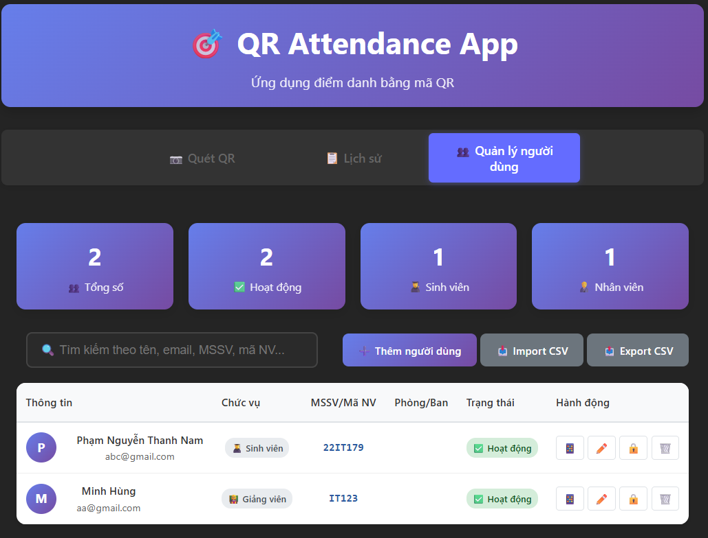
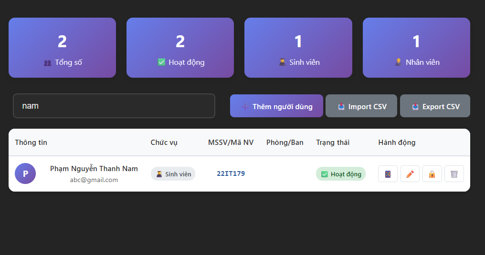
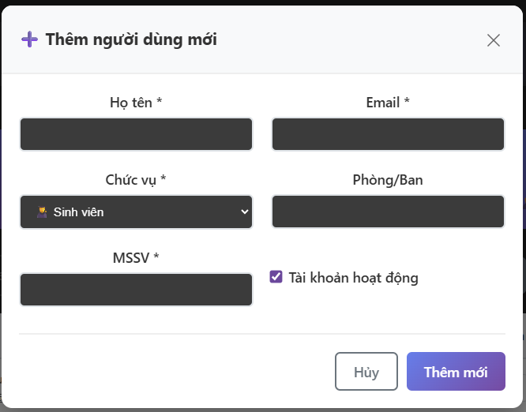
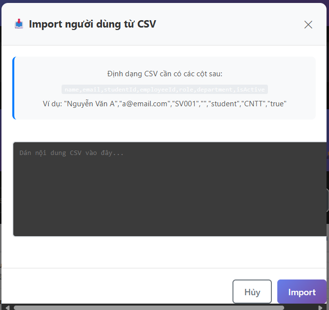
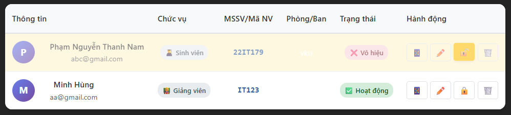
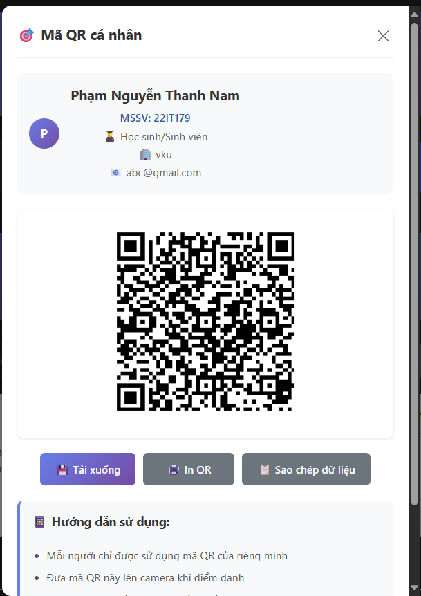
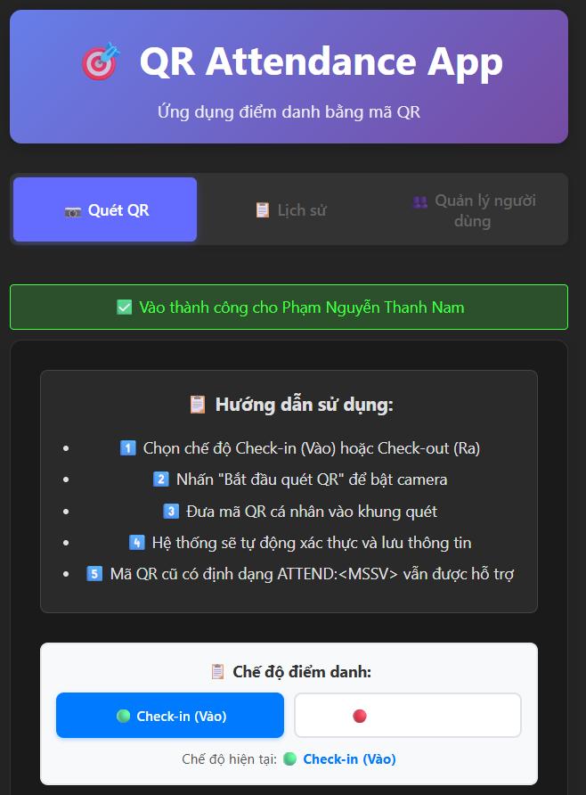
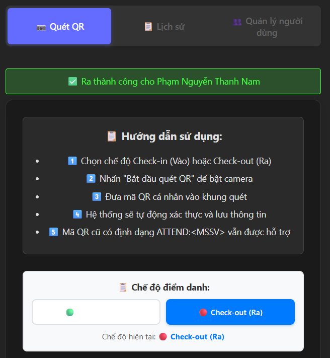
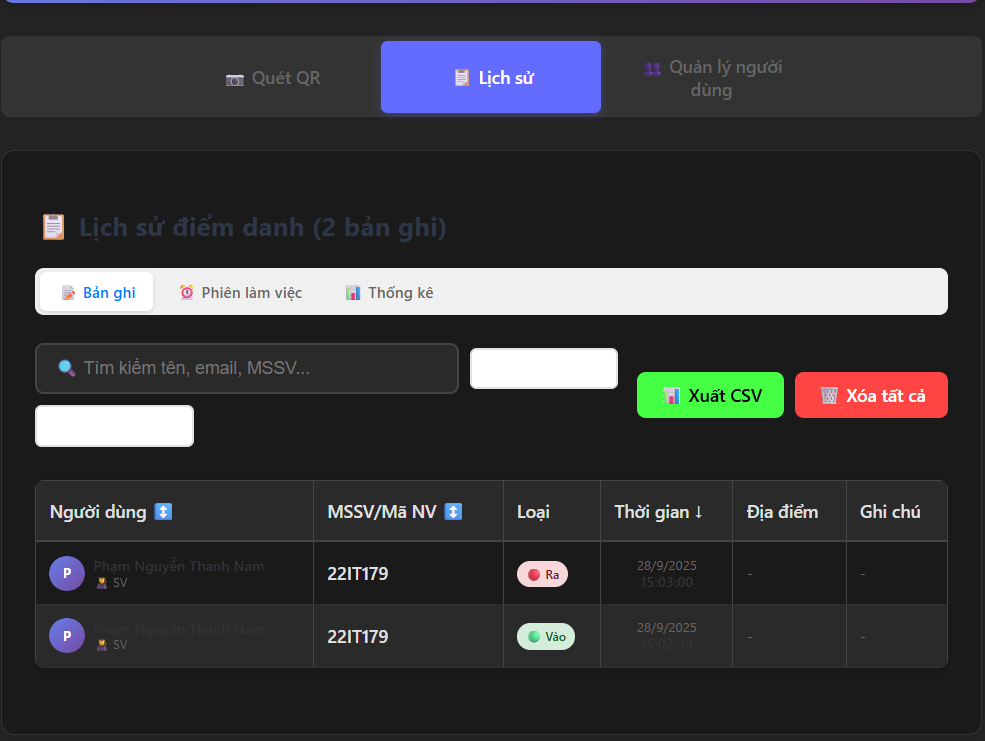
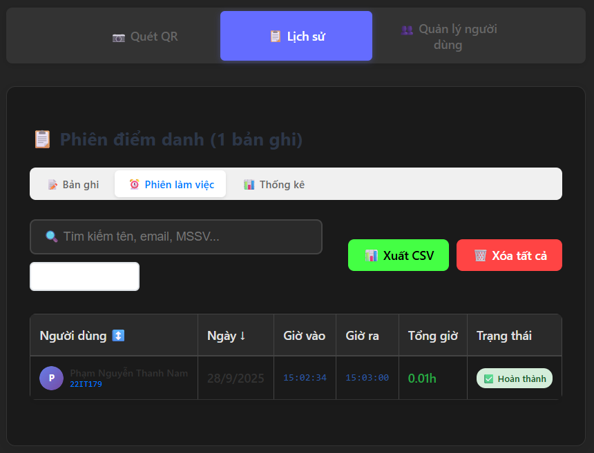

# 🎯 QR Attendance App

Ứng dụng điểm danh bằng mã QR được xây dựng với React, Vite và Capacitor. Ứng dụng hỗ trợ cả web và mobile, cho phép quản lý điểm danh hiệu quả thông qua mã QR cá nhân.

## ✨ Tính năng chính

### 📱 Điểm danh QR
- **Quét mã QR**: Sử dụng camera để quét mã QR điểm danh
- **Hai chế độ**: Check-in (Vào) và Check-out (Ra)
- **Tự động xác thực**: Hệ thống tự động nhận diện và lưu thông tin
- **Tương thích**: Hỗ trợ cả mã QR mới và mã QR cũ (định dạng ATTEND:<MSSV>)

### � Quản lý người dùng
- **Thêm người dùng**: Tạo mới người dùng với thông tin đầy đủ
- **Phân loại**: Hỗ trợ 3 loại người dùng (Sinh viên, Nhân viên, Giáo viên)
- **Tạo mã QR**: Tự động tạo mã QR cá nhân cho từng người dùng
- **Tìm kiếm & lọc**: Tìm kiếm theo tên, MSSV, email
- **Import/Export**: Nhập dữ liệu từ CSV và xuất báo cáo
- **In mã QR**: Tải xuống và in mã QR cá nhân

### 📋 Lịch sử điểm danh
- **Xem chi tiết**: Theo dõi tất cả bản ghi điểm danh
- **Thống kê**: Báo cáo số liệu điểm danh theo ngày/tháng
- **Phiên làm việc**: Tính toán thời gian làm việc tự động
- **Xuất dữ liệu**: Export CSV cho báo cáo
- **Lọc và sắp xếp**: Tìm kiếm theo tên, ngày, loại điểm danh

### 🔧 Tính năng nâng cao
- **Responsive Design**: Hoạt động mượt mà trên mọi thiết bị
- **LocalStorage**: Lưu trữ dữ liệu cục bộ an toàn
- **Real-time Updates**: Cập nhật dữ liệu theo thời gian thực
- **Thông báo**: Thông báo trạng thái điểm danh thành công/thất bại

## 🔐 Bảo mật & Lưu ý

### Tính năng bảo mật
- **Mã QR cá nhân**: Mỗi người dùng có mã QR riêng biệt
- **Chữ ký số**: QR code có chữ ký để tránh giả mạo
- **Kiểm tra tài khoản**: Xác minh người dùng còn hoạt động
- **Timestamp**: Mã QR có thể expire theo thời gian
  
## Screenshot
## Giao diện hệ thống

- **Giao diện chính**  
  

- **Quản lý người dùng**  
  

- **Tìm kiếm**  
  

- **Thêm người dùng**  
  

- **Import file**  
  

- **Vô hiệu hóa / Kích hoạt tài khoản**  
  

- **Mã QR cá nhân**  
  

- **Check in**  
  

- **Check out**  
  

- **Lịch sử điểm danh**  
  

- **Thời gian làm việc**  
  

- **Thống kê**  
  

